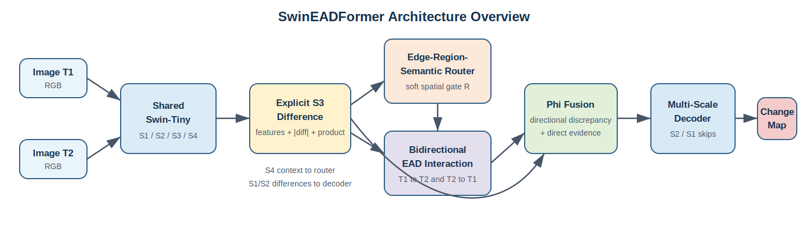
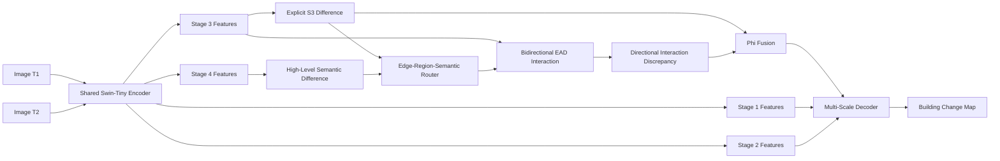

# EAD-Former

This repository provides a limited public implementation of
**SwinEADFormer**, an edge-aware dynamic Swin Transformer designed for binary
building change detection in high-resolution remote sensing images.

The release contains the proposed architecture and sanitized training and
evaluation entry-point references. It does not redistribute baseline
implementations, the internal dataset and utility package, environment files,
pretrained weights, or datasets. It is therefore not a standalone executable
reproduction package.



## Overview

Binary building change detection aims to identify structural changes between
two co-registered remote sensing images acquired at different times.

A major difficulty is that changed pixels are usually sparse, while illumination
variation, shadows, seasonal differences, local texture changes, and slight
misregistration can produce non-zero temporal responses in unchanged regions.
When cross-temporal interaction is applied uniformly to all spatial locations,
these background responses may be propagated to the decoder.

SwinEADFormer addresses this problem through a task-driven interaction
mechanism. Its main design principle is:

> Cross-temporal interaction should be conditioned on structural change
> evidence, and the discrepancy between the two temporal directions should be
> combined with direct temporal difference evidence.

The architecture incorporates this principle through:

- explicit mid-level difference construction;
- an image-pair-specific edge-region-semantic router;
- output-gated bidirectional cross-temporal interaction;
- directional interaction discrepancy modeling;
- Phi fusion with direct difference evidence;
- multi-scale spatial detail recovery.

These components encode task-specific inductive biases for building change
detection. They do not constitute a formal theoretical guarantee.

## Architecture



## Method Components

### 1. Shared hierarchical encoder

A shared Swin-Tiny encoder extracts four stages of hierarchical features from
the two temporal images:

$$
\{F_i^1,F_i^2,F_i^3,F_i^4\}=E(I_i), \qquad i\in\{1,2\}.
$$

The shared weights map the two images into the same representation space.
Stage-3 features are used for difference construction and cross-temporal
interaction. Stage-4 features provide high-level semantic context. Stage-1 and
Stage-2 differences are used during spatial recovery.

### 2. Explicit S3 difference construction

The mid-level difference representation combines the original temporal
features, their absolute difference, and their element-wise product:

$$
D_m=\phi_d\left(
[F_1^3,F_2^3,|F_1^3-F_2^3|,F_1^3\odot F_2^3]
\right).
$$

The original features preserve temporal content. The absolute difference
provides direct change evidence. The element-wise product represents feature
agreement between the two observations.

The S3 level is selected as a practical balance between semantic reliability
and spatial detail.

### 3. Edge-region-semantic router

The router generates a soft spatial gate from three complementary cues:

$$
U_e=2\operatorname{Norm}(\operatorname{Sobel}(\psi(D_m)))-1,
$$

$$
U_r=\phi_r(D_m),
$$

$$
U_s=\operatorname{Up}(\phi_s(D_h)),
\qquad
D_h=|F_1^4-F_2^4|.
$$

The final router is

$$
R=\sigma(U_e+U_r+U_s+b).
$$

The three cues have different roles:

- the edge cue represents local structural transitions;
- the region cue represents compact mid-level change evidence;
- the semantic cue provides high-level contextual guidance.

The learnable bias is initialized with a negative prior because changed pixels
are usually sparse in building change detection datasets.

### 4. Router-gated cross-temporal interaction

The router is applied to the output of cross-temporal attention before residual
addition:

$$
\widetilde{X}
=
\operatorname{Attn}
\left(
\operatorname{GN}(X),
\operatorname{GN}(Y)
\right)
\odot R.
$$

This design retains all spatial tokens in the attention computation. The router
changes the spatial amplitude of the interaction response without removing
tokens from the attention operation.

The original query feature remains available through the residual path.

### 5. Bidirectional EAD interaction

Cross-temporal attention is directional because the query and reference
features have different roles. SwinEADFormer therefore models both directions:

$$
O_{12}=\operatorname{EAD}^{(2)}(F_1^3,F_2^3,R),
$$

$$
O_{21}=\operatorname{EAD}^{(2)}(F_2^3,F_1^3,R).
$$

Their absolute discrepancy is used as interaction-derived change evidence:

$$
D_{\mathrm{int}}=|O_{12}-O_{21}|.
$$

This representation captures information that may not be preserved by a single
direction of temporal interaction.

### 6. Phi fusion

The final S3 change representation combines three evidence sources:

$$
Z=\Phi\left(
[|O_{12}-O_{21}|,D_m,|F_1^3-F_2^3|]
\right).
$$

These inputs respectively represent:

1. bidirectional interaction discrepancy;
2. learned composite S3 difference;
3. direct temporal feature difference.

The purpose of Phi fusion is to prevent the prediction from relying exclusively
on either attention-derived evidence or direct differencing.

### 7. Multi-scale decoder

The fused representation is progressively upsampled and combined with shallow
absolute-difference features from Stage 2 and Stage 1.

This coarse-to-fine decoder recovers spatial details that are reduced by the
hierarchical encoder and supports building boundary localization.

## Model Interface

The architecture accepts two co-registered RGB image tensors:

$$
I_1,I_2\in\mathbb{R}^{B\times3\times H\times W}.
$$

For the configuration used in the study, the expected spatial size is
$256\times256$.

The model returns a dictionary containing:

| Output | Description |
|---|---|
| `pred` | Main single-channel change logits |
| `aux` | Auxiliary S3 prediction logits |
| `edge` | Resized soft router map |
| `sparsity_loss` | Mean router activation used for regularization |

The public entry-point files expose the main optimization and metric interfaces,
but the repository does not provide all internal modules and artifacts required
to reproduce the reported experiments.

## Repository Structure

```text
EAD-Former/
├── README.md
├── MODEL_CARD.md
├── .gitignore
├── train.py
├── test.py
├── assets/
│   └── architecture_overview.svg
├── configs/
│   └── architecture.yaml
├── docs/
│   ├── architecture.md
│   ├── datasets.md
│   ├── design_principles.md
│   └── release_scope.md
└── models/
    ├── __init__.py
    ├── swin_eadformer.py
    └── modules/
        ├── __init__.py
        ├── router.py
        ├── interaction.py
        └── decoder.py
```

- `models/swin_eadformer.py` defines the complete SwinEADFormer data flow.
- `models/modules/` separates the router, interaction, and decoder components.
- `train.py` and `test.py` are sanitized reference entry points. They require
  explicit data paths and depend on internal support modules that are not part
  of this release.
- `configs/architecture.yaml` records architecture metadata only. It is not a
  training configuration.
- `docs/` explains the architecture, design principles, and release boundary.
- `MODEL_CARD.md` summarizes the intended task, inputs, outputs, and limits.
- `.gitignore` prevents local data, weights, checkpoints, logs, results, and
  environment files from being committed accidentally.

## Documentation

- [Architecture](docs/architecture.md)
- [Datasets and study protocol](docs/datasets.md)
- [Design principles](docs/design_principles.md)
- [Public release scope](docs/release_scope.md)
- [Model card](MODEL_CARD.md)

## Baseline Implementations

Baseline implementations are not included in this repository. Obtain each
baseline from the official repository maintained by its original authors and
follow the corresponding license, environment, configuration, and citation
instructions. This repository does not provide modified or reimplemented
copies of competing methods.

## Release Scope

This limited public release includes:

- the full SwinEADFormer model definition;
- the edge-region-semantic router;
- router-gated cross-temporal attention;
- bidirectional EAD interaction;
- Phi fusion;
- the multi-scale decoder;
- sanitized training and evaluation entry-point references.

It intentionally excludes:

- baseline implementations, which should be obtained from the official
  repositories maintained by their original authors;
- the internal dataset loader, boundary metrics, and utility package referenced
  by the entry-point files;
- dataset downloading, preprocessing, and split manifests;
- a complete executable training and evaluation pipeline;
- internal experiment scheduling and visualization scripts;
- environment configuration;
- pretrained weights and checkpoints;
- logs, numerical result files, and manuscript materials.

Therefore, this repository should not be interpreted as an end-to-end
reproducibility package.

## Data Availability

The study uses publicly available remote sensing change detection datasets,
including:

- LEVIR-CD;
- WHU-CD;
- SYSU-CD.

No new remote sensing image dataset was generated. The datasets remain available
from their original providers and are not redistributed in this repository.
Official sources, dataset characteristics, citations, and the patch-level
protocol used in the study are documented in
[Datasets and study protocol](docs/datasets.md).

## Current Status

This repository accompanies a manuscript under the publication process. The
model code represents the full SwinEADFormer configuration described in the
manuscript. The public entry-point files document selected training and
evaluation interfaces but do not form a complete runtime package.

Repository contents and citation information may be updated after completion of
the publication process.

## Citation

Citation information will be added after the manuscript receives its final
publication record.
